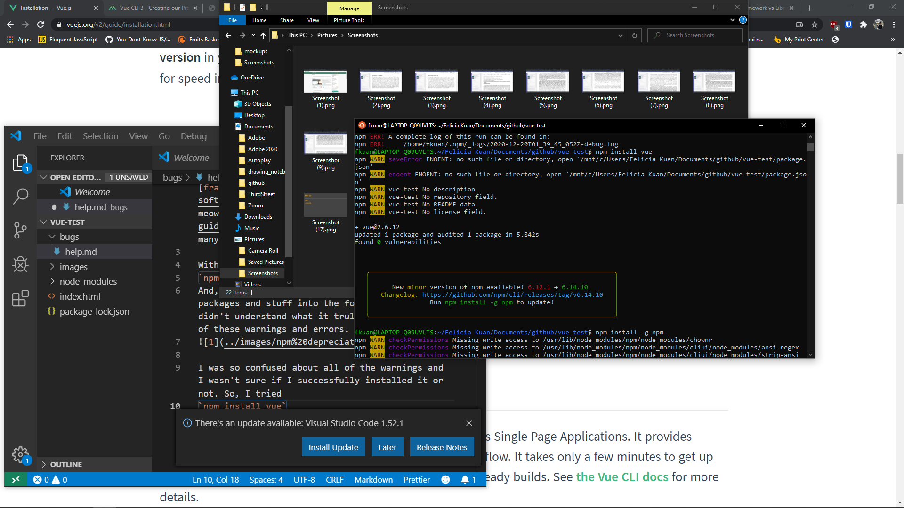
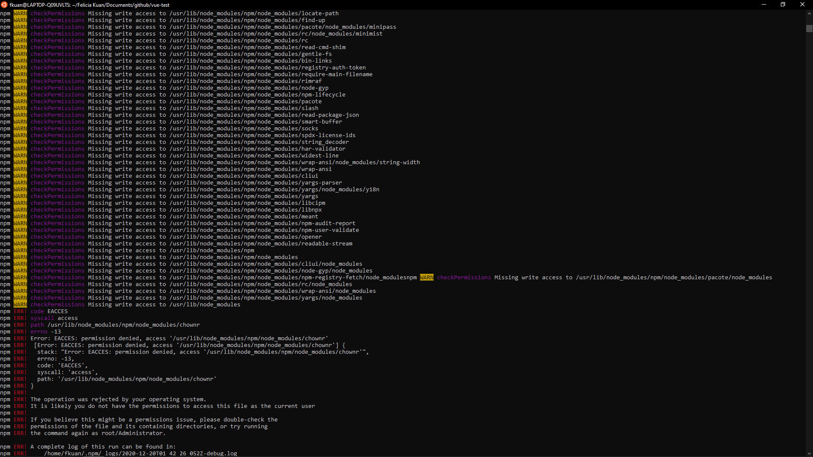

## Installation Issues

This is my first time developing with a [framework](https://www.geeksforgeeks.org/software-framework-vs-library/), and Derricku meowmeow suggested [Vue](https://vuejs.org/v2/guide/installation.html). However, I ran into many issues, even at the installation phase.

Within the project directory, I entered
`npm i -g @vue/cli`
And, although this downloaded a bunch of packages and stuff into the folder that I didn't understand what it truly did, I had all of these warnings and errors.

I was so confused about all of the warnings and I wasn't sure if I successfully installed it or not. So, I tried
`npm install vue`

This one, not sure what it did, but told me to update npm, so I was like "ok, let's try that command they suggested!"

`npm install -g npm`

and now, I'm wondering if updating npm is even necessary.
